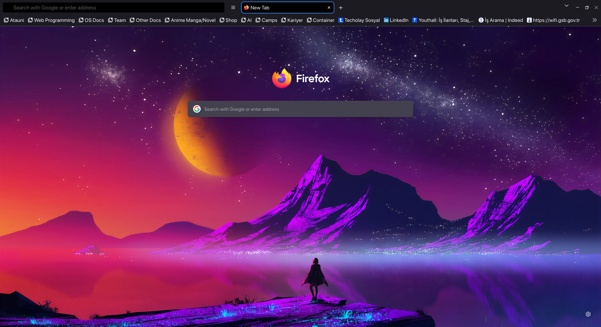
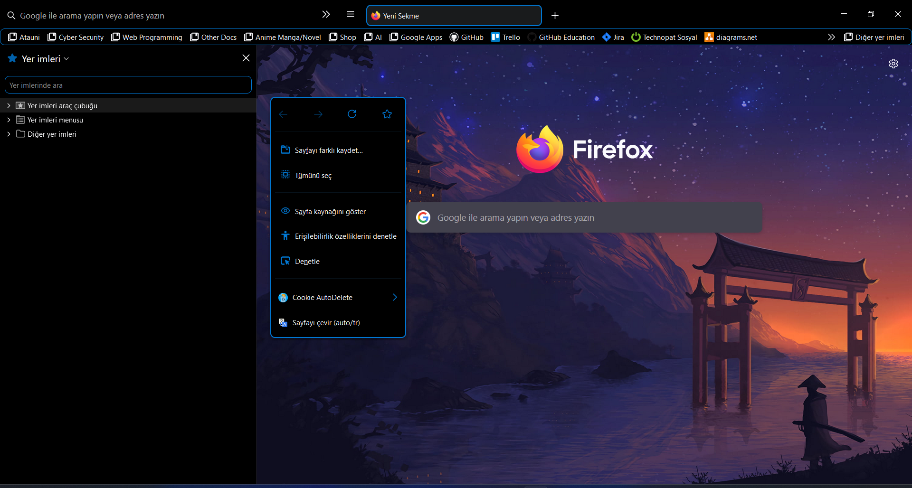
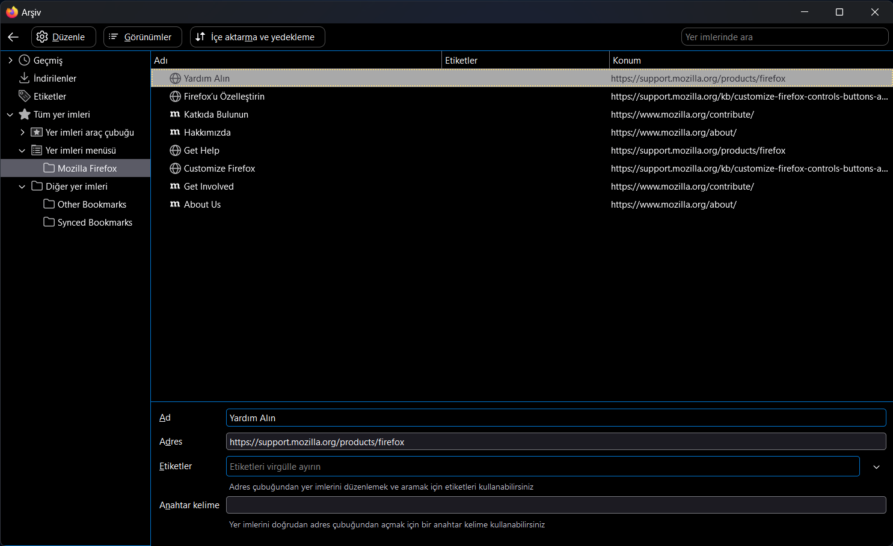

<div align="center">

  # [RealFire_🔥](https://github.com/Hakanbaban53/RealFire)
  **A minimalist animated oneliner theme for Firefox perfectly matching Sweet Dark**
</div>

<p align="center"></p>

<h3 align="center">Floating Navigation with Animated Background</h3>
<p align="center"></p>

<h3 align="center">Auto-hide Scrollbars</h3>
<p align="center"></p>

<h3 align="center">Context Menu</h3>
<p align="center"></p>

<h3 align="center">Library</h3>
<p align="center"></p>

## Folder structure

```css
 .
├──  assets
│  └──  preview images
├──  css
│  ├──  realfire-checkbox.css
│  ├──  realfire-icons.css
│  ├──  realfire-config.css
│  └──  other .css files
├──  icons
│  ├──  animation.svg
│  └──  many icons in .svg format
├──  programs
│  ├──  install-cfg.sh
│  ├──  install-curl.sh
│  ├──  install.sh
│  ├──  install-curl.bat
│  ├──  install.bat
│  ├──  local-settings.js
│  ├──  mozilla.cfg
│  └──  user.js
├──  README.md
├──  userChrome.css
└──  userContent.css

```

### [`userChrome.css`](./userChrome.css)
This helps to customize Firefox User Interface.

### [`userContent.css`](./userContent.css)
This helps to customize web content like a specific site.


## **But how does it work?**
Custom startup-script (aka [`mozilla.cfg`](./programs/mozilla.cfg) here) is loaded using [`local-settings.js`](./programs/local-settings.js). This startup-script adds "loader" scripts from `utils` folder that loads arbitrary javascript files from the `script` folder into Firefox<br>
`mozilla.cfg` also helps in setting local webpage as your homepage. Details in [Installation](#Installation).

> **Note**
>
> Firefox team has removed XBL from Firefox starting with version 72, so userChrome.js would not work :/

# Installation

> **Note**
>
> If you are planning to set a local page as home page then in [`mozilla.cfg`](https://github.com/PROxZIMA/Sweet-Pop/blob/4ec550b7d7fb6a56d247385763a80a5da7efa2e0/programs/mozilla.cfg#L12-L14), uncomment line `12, 13, 14` and at line `13` change `newTabURL_` to the local page location.

<details><summary>Script Installation</summary>

1) Clone the repository and enter folder:

    ```console
    $ git clone https://github.com/Hakanbaban53/RealFire.git && cd RealFire
    ```

2) Run installation script

    This script will lookup default Firefox profile location and install the theme with default configurations.

    <details><summary>Linux/MacOS</summary><br>

    ```console
    $ ./programs/install.sh # Standard
    $ ./programs/install.sh -f ~/.var/app/org.mozilla.firefox/.mozilla/firefox # Flatpak
    ```
    </details>

   <details><summary>Windows</summary><br>

    ```powershell
    > programs\install.bat REM Standard
    > programs\install.bat -e -b "C:\Program Files (x86)\Mozilla Firefox" REM Disable fx-autoconfig and Custom binary folder
    ```
    </details>

    #### Script options
    - `-b <binary_folder>` *optional*
        - Set custom Firefox binary folder path, for example `/usr/lib32/firefox`
        - Default: Auto detects in linux. `C:\Program Files\Mozilla Firefox` in windows

    - `-f <firefox_folder>` *optional*
        - Set custom Firefox folder path, for example `~/.mozilla/icecat/`
        - Default: `~/.mozilla/firefox/` in linux. `%APPDATA%\Mozilla\Firefox` in windows

    - `-p <profile_name>` *optional*
        - Set custom profile name, for example `4htgy4pu.app`
        - Default: Profile folder name found in `profiles.ini` at ->
        ```
        [Install4F96D1932A9F858E]
        Default=1yrah0xg.default-release
        Locked=1
        ```

    - `-e` *optional*
        - Install [`fx-autoconfig`](https://github.com/MrOtherGuy/fx-autoconfig)
        - Runs sudo to copy `mozilla.cfg` and `local-settings.js` to Application Binary folder
        - Default: True

    - `-h` *optional*
        - Shows help message with flags info
</details>

<details><summary>Curl based Installation</summary>

- You can also install this theme with one command:

    <details><summary>Linux/MacOS</summary><br>

    ```console
    $ curl -s -o- https://raw.githubusercontent.com/Hakanbaban53/RealFire/master/programs/install-curl.sh | bash # Standard
    $ curl -s -o- https://raw.githubusercontent.com/Hakanbaban53/RealFire/master/programs/install-curl.sh | bash -s -- -f ~/.var/app/org.mozilla.firefox/.mozilla/firefox # Flatpak
    ```
    </details>

   <details><summary>Windows</summary><br>

    ```powershell
    > curl -sL "https://raw.githubusercontent.com/Hakanbaban53/RealFire/master/programs/install-curl.bat" > %TEMP%\install-curl.bat && %TEMP%\install-curl.bat REM Standard
    > curl -sL "https://raw.githubusercontent.com/Hakanbaban53/RealFire/master/programs/install-curl.bat" > %TEMP%\install-curl.bat && %TEMP%\install-curl.bat -b "C:\Program Files (x86)\Mozilla Firefox" REM Custom binary folder

    ```
    </details>

    This will download the master branch and run the installation script.
    `mozilla.cfg` can be configured after complete installation
</details>

<details><summary>Manual Installation</summary>

1) Open `about:support` in new tab and click `Open Directory` near `Profile Directory`.

2) Open this directory in terminal and clone the repository

    Note: If you already have a `chrome` folder under `Profile Directory`, rename it to `chrome_bak` or anything else to preserve your old theme.

    ```console
    $ cd {Your profile directory}

    $ git clone https://github.com/Hakanbaban53/RealFire.git chrome

    $ cd chrome
    ```

3) Install `boot.jsm` file from [fx-autoconfig](https://github.com/MrOtherGuy/fx-autoconfig/tree/master/profile/chrome/utils) in the `chrome/utils` folder (make sure it matches above Folder Structure).

    ```console
    $ curl -sL "https://raw.githubusercontent.com/MrOtherGuy/fx-autoconfig/master/profile/chrome/utils/boot.jsm" > "utils/boot.jsm"
    ```

4) Move `user.js`, `mozilla.cfg` and `local-settings.js` to their destination.

    <details><summary>Linux</summary><br>

    - `about:support` > `Application Binary` > `{Installation folder}firefox-bin`<br>
    Generally `Installation folder` is `/usr/lib/firefox/`

    ```console
    $ ln -s "`pwd`/programs/user.js" ../user.js

    $ cp ./programs/mozilla.cfg /usr/lib/firefox/

    $ cp ./programs/local-settings.js /usr/lib/firefox/defaults/pref/
    ```
    </details>

   <details><summary>MacOS</summary><br>

    - `about:support` > `Application Binary` > `{Installation folder}firefox`<br>
    Generally `Installation folder` is `/Applications/Firefox.app/Contents/MacOS/` (`Firefox Nightly` for Nightly version)

      For `MacOS`, our destination folder is `/Applications/Firefox.app/Contents/Resources/`

    ```console
    $ ln -s "`pwd`/programs/user.js" ../user.js

    $ cp ./programs/mozilla.cfg /Applications/Firefox.app/Contents/Resources/

    $ cp ./programs/local-settings.js /Applications/Firefox.app/Contents/Resources/defaults/pref/
    ```
    </details>

    <details><summary>Windows</summary><br>

    - `about:support` > `Application Binary` > `{Installation folder}firefox.exe`<br>
    Generally `Installation folder` is `C:\Program Files\Mozilla Firefox\`

    ```powershell
    > mklink ..\user.js "%cd%\programs\user.js"

    > copy .\programs\mozilla.cfg "C:\Program Files\Mozilla Firefox\"

    > copy .\programs\local-settings.js "C:\Program Files\Mozilla Firefox\defaults\pref\"
    ```
    </details>

5) Download [`navbarToolbarButtonSlider.uc.js`](https://github.com/aminomancer/uc.css.js/blob/master/JS/navbarToolbarButtonSlider.uc.js) and place it in `script` folder along with `hideScrollbar.uc.js`.

    ```console
    $ curl -sL "https://raw.githubusercontent.com/aminomancer/uc.css.js/master/JS/navbarToolbarButtonSlider.uc.js" > "script/navbarToolbarButtonSlider.uc.js"
    ```

</details>

#### Follow-up changes
1) In Firefox
    - Right click hamburger button > `customize toolbar` disable `Title Bar`, `Drag Space`.
    - Remove `Flexible Space` from urlbar.
    - Set Density to `Compact/Normal/Touch` and Themes to `Dark` or `Light` (`Compact` is buggy in Windows).

2) Open `about:support` > `Clear startup cache...` > `Restart` ***twice***

3) ### **Voilà**

## Configuration
1) `programs/user.js` contains user preferences that are automatically loaded at startup. So no need to manually set them during installation

2) You can set any background in the toolbox. Edit `--tabbar-gradient-color` in [`userChrome.css`](./userChrome.css) to a static color or linear-background or any SVG `¯\_༼ •́ ͜ʖ •̀ ༽_/¯`.

3) You can change `--tab-radius` and `--tab-border-width` to increase/decrease tab border radius and width respectively to match `normal` and `touch` density.

4) Hide menu icons by commenting [Line 9](https://github.com/Hakanbaban53/RealFire/blob/master/userChrome.css#L9) in [`userChrome.css`](./userChrome.css).

5) You can disable any of the `script/*.uc.js` from `Toolbar Menu > Tools > userscripts > script`. Restart ***twice***, every time you enable/disable the script.

6) You can also edit `hideScrollbar.uc.js` to customize the scrollbars according to your taste.

7) For adding your own customizations make changes in `myChanges.css` file under `css` folder.

8) If something breaks on your system then please raise a issue


## Credits
- I started with this amazing material theme : [MaterialFox](https://github.com/muckSponge/MaterialFox) by [muckSponge](https://github.com/muckSponge)

- One of the best dark theme for Firefox : [ShadowFox](https://overdodactyl.github.io/ShadowFox) by [overdodactyl](https://github.com/overdodactyl)

- Floating Toolbox : [u/oldworlds](https://www.reddit.com/r/FirefoxCSS/comments/koa71w/minimalfox_a_compact_and_minimal_theme/)

- [Theme inspiration](https://www.reddit.com/r/FirefoxCSS/comments/ci7i69/another_oneline_theme/) by [u/SENDMEJUDES](https://www.reddit.com/user/SENDMEJUDES/)

- [u/It_Was_The_Other_Guy](https://www.reddit.com/user/It_Was_The_Other_Guy) helped me a lot on [r/FirefoxCSS](https://www.reddit.com/r/FirefoxCSS/)<br>
Also this theme uses his [`fx-autoconfig`](https://github.com/MrOtherGuy/fx-autoconfig) to load the javascripts files.

- [`navbarToolbarButtonSlider.uc.js`](https://github.com/aminomancer/uc.css.js#navbar-toolbar-button-slider) script by [u/MotherStylus](https://www.reddit.com/user/MotherStylus) adds button slider to navbar toolbar. More details [here](https://www.reddit.com/r/FirefoxCSS/comments/n9asta/addons_width_changes_to_a_fixed_value_when_placed/)

- [Setting local page as homepage](https://www.reddit.com/r/firefox/comments/ge86z4/newtab_page_to_local_file_firefox_76_redux/)

- Auto hide scrollbars : details [here](https://www.reddit.com/r/FirefoxCSS/comments/jptrf8/is_it_still_possible_to_autohide_and_show/) by [u/mimecry](https://www.reddit.com/user/mimecry/)


- [Installation script](https://github.com/rafaelmardojai/firefox-gnome-theme) details.
___

## Stargazers over time

[](https://starchart.cc/Hakanbaban53/RealFire)

[Back to top](#RealFire_🔥)
___
<p align="center">Made with ❤️</p>
<h2 align="center">Hakan İSMAİL</h2>
