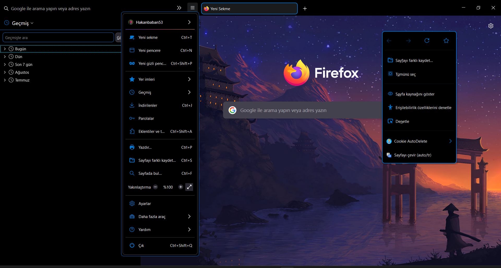
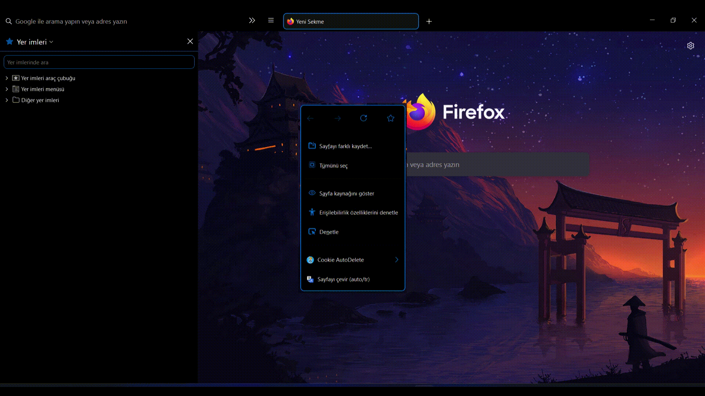

<div align="center">

  # [RealFire 🔥](https://github.com/Hakanbaban53/RealFire)
  **A minimalist animated oneliner theme for Firefox perfectly matching real Dark**
</div>

<h2 align="center">RealFire</h2>
<p align="center"></p>

<h3 align="center">Adaptive Tab Bar Extension Support</h3>
<p align="center"></p>

<h3 align="center">Horizonal Tabs</h3>
<p align="center"></p>

<h3 align="center">MacOs Window Control & Fonts</h3>
<p align="center" style="max-heigh:250px"></p>

<h3 align="center">Animated Background</h3>
<p align="center" style="max-heigh:250px"></p>

<h3 align="center">Tab Preview</h3>
<p align="center" style="max-heigh:300px"></p>

<h3 align="center">Context Menu</h3>
<p align="center"></p>

<h3 align="center">Auto-hide Scrollbars</h3>
<p align="center" style="max-heigh:250px"></p>

<h3 align="center">Library</h3>
<p align="center"></p>

<h3 align="center">Adaptive Window Color With Windows & GNU/Linux</h3>
<p align="center"></p>

## Folder structure

```css
 .
├──  assets
│  └──  preview images
├──  img
│  └──  new tab background image
├──  icons
│  ├──  animation.svg
│  └──  many icons in .svg format
├──  includes
│  ├──  realfire-checkbox.css
│  ├──  realfire-icons.css
│  ├──  realfire-config.css
│  └──  other .css files
├──  JS
│  ├──  aboutUserChrome.sys.mjs
│  ├──  navbarToolbarButtonSlider.uc.js
│  ├──  tabThumbnailTooltip.uc.js
│  ├──  verticalTabsPane.uc.js
│  ├──  tabThumbnailTooltip.uc.js
│  ├──  macosTheme.us.js
│  └──  many script in .uc.js format
├──  programs
│  ├──  install-cfg.sh
│  ├──  install.sh
│  ├──  install-curl.sh
│  ├──  install.bat
│  ├──  install-curl.bat
│  ├──  local-settings.js
│  ├──  mozilla.cfg
│  └──  user.js
├──  resources
│  └──  userchrome Manager page files
├──  utils
│  ├──  .editorconfig
│  ├──  boot.sys.mjs
│  ├──  chrome.manifest
│  ├──  fs.sys.mjs
│  └──  utils.sys.mjs
├──  README.md
├──  userChrome.css
└──  userContent.css

```

### [`userChrome.css`](./userChrome.css)
This helps to customize Firefox User Interface.

### [`userContent.css`](./userContent.css)
This helps to customize web content like a specific site.

### [`aboutUserChrome.sys.mjs by aminomancer`](https://github.com/aminomancer/uc.css.js#aboutUserChrome)
This script helps to enabled or disabled browser scripts. Adding new entry the application menu named UserChrome Maneger (Shortcut `Ctrl+Shift+U`).

### [`tabThumbnailTooltip.uc.js`](https://github.com/aminomancer/uc.css.js#tab-thumbnail-tooltip)
Show a large thumbnail image to preview tab content when hovering a tab.

### [`hideScrollbar.uc.js`](./JS/hideScrollbar.uc.js)
It's now possible to autohide scrollbars.

### [`navbarToolbarButtonSlider.uc.js by aminomancer`](https://github.com/aminomancer/uc.css.js#navbar-toolbar-button-slider)
As this is a one-liner theme, one must drop some buttons to add sufficient space for urlbar and tabbar. But this messed up with their widths. Take a look [here](https://www.reddit.com/r/FirefoxCSS/comments/n9asta/addons_width_changes_to_a_fixed_value_when_placed/). I did some temporary fix(which was not that good). But [u/MotherStylus](https://www.reddit.com/user/MotherStylus) came up with an awesome `uc.js` script.<br>
So basically this adds a button slider to navbar toolbar. [This](https://raw.githubusercontent.com/Hakanbaban53/RealFire/main/assets/navbar.gif) is how it looks. Read the file description to configure it properly.

### [`verticalTabsPane.uc.js by aminomancer (Edited for RealFire)`](./JS/verticalTabsPane.uc.js)
This script create a vertical pane across from the sidebar that functions like the vertical tabs pane in Microsoft Edge. Writed by [aminomancer](https://github.com/aminomancer) but I edited full compatibility for RealFire.

### [`macosTheme.uc.js`](./JS/macosTheme.uc.js)
This script to convert font and window controls to macos style.


#### [`You can look here to find out what other scripts do.`](https://github.com/aminomancer/uc.css.js#script-conventions)


## **But how does it work?**
Custom startup-script (aka [`mozilla.cfg`](./programs/mozilla.cfg) here) is loaded using [`local-settings.js`](./programs/local-settings.js). This startup-script adds "loader" scripts from `utils` folder that loads arbitrary javascript files from the `script` folder into Firefox<br>
`mozilla.cfg` also helps in setting local webpage as your homepage. Details in [Installation](#Installation) (Currently Not Working ⚠️).

# Installation

<details><summary>Curl based Installation</summary>

- You can also install this theme with one command:

    <details><summary>GNU/Linux & MacOS</summary><br>

    ```console
    $ curl -s -o- https://raw.githubusercontent.com/Hakanbaban53/RealFire/main/programs/install-curl.sh | bash # Standard
    $ curl -s -o- https://raw.githubusercontent.com/Hakanbaban53/RealFire/main/programs/install-curl.sh | bash -s -- -f ~/.var/app/org.mozilla.firefox/.mozilla/firefox # Flatpak
    $ curl -s -o- https://raw.githubusercontent.com/Hakanbaban53/RealFire/main/programs/install-curl.sh | bash -s -- -f ~/snap/firefox/common/.mozilla/firefox/ # Snap
    ```
    </details>

   <details><summary>Windows</summary><br>

    ```powershell
    > curl -sL "https://raw.githubusercontent.com/Hakanbaban53/RealFire/main/programs/install-curl.bat" > %TEMP%\install-curl.bat && %TEMP%\install-curl.bat REM Standard
    > curl -sL "https://raw.githubusercontent.com/Hakanbaban53/RealFire/main/programs/install-curl.bat" > %TEMP%\install-curl.bat && %TEMP%\install-curl.bat -b "C:\Program Files (x86)\Mozilla Firefox" REM Custom binary folder
    ```
    
    </details>

    This will download the master branch and run the installation script.
    `mozilla.cfg` can be configured after complete installation
</details>

<details><summary>Script Installation</summary>

1) Clone the repository and enter folder:

    ```console
    $ git clone https://github.com/Hakanbaban53/RealFire.git && cd RealFire
    ```

2) Run installation script

    This script will lookup default Firefox profile location and install the theme with default configurations.

    <details><summary>GNU/Linux & MacOS</summary><br>

    ```console
    $ ./programs/install.sh # Standard
    $ ./programs/install.sh -f ~/.var/app/org.mozilla.firefox/.mozilla/firefox # Flatpak
    $ ./programs/install.sh -f ~/snap/firefox/common/.mozilla/firefox/ # Snap
    ```
    </details>

   <details><summary>Windows</summary><br>

    ```powershell
    > programs\install.bat REM Standard
    > programs\install.bat -e -b "C:\Program Files (x86)\Mozilla Firefox" REM Disable fx-autoconfig and Custom binary folder
    ```
    </details>

    #### Script options
    - `-b <binary_folder>` *optional*
        - Set custom Firefox binary folder path, for example `/usr/lib32/firefox`
        - Default: Auto detects in linux. `C:\Program Files\Mozilla Firefox` in windows

    - `-f <firefox_folder>` *optional*
        - Set custom Firefox folder path, for example `~/.mozilla/icecat/`
        - Default: `~/.mozilla/firefox/` in linux. `%APPDATA%\Mozilla\Firefox` in windows

    - `-p <profile_name>` *optional*
        - Set custom profile name, for example `4htgy4pu.app`
        - Default: Profile folder name found in `profiles.ini` at ->
        ```
        [Install4F96D1932A9F858E]
        Default=1yrah0xg.default-release
        Locked=1
        ```

    - `-e` *optional*
        - Install [`fx-autoconfig`](https://github.com/MrOtherGuy/fx-autoconfig)
        - Runs sudo to copy `mozilla.cfg` and `local-settings.js` to Application Binary folder
        - Default: True

    - `-h` *optional*
        - Shows help message with flags info
     </details>

<details><summary>Manual Installation</summary>

1) Open `about:support` in new tab and click `Open Directory` near `Profile Directory`.

2) Open this directory in terminal and clone the repository

    Note: If you already have a `chrome` folder under `Profile Directory`, rename it to `chrome_bak` or anything else to preserve your old theme.

    ```console
    $ cd {Your profile directory}
    
    $ git clone https://github.com/Hakanbaban53/RealFire.git chrome
    
    $ cd chrome
    ```


   <details><summary>MacOS</summary><br>

    - `about:support` > `Application Binary` > `{Installation folder}firefox`<br>
    Generally `Installation folder` is `/Applications/Firefox.app/Contents/MacOS/` (`Firefox Nightly` for Nightly version)
    
      For `MacOS`, our destination folder is `/Applications/Firefox.app/Contents/Resources/`
    
    ```console
    $ ln -s "`pwd`/programs/user.js" ../user.js
    
    $ cp ./programs/mozilla.cfg /Applications/Firefox.app/Contents/Resources/
    
    $ cp ./programs/local-settings.js /Applications/Firefox.app/Contents/Resources/defaults/pref/
    ```
    </details>
    
    <details><summary>Windows</summary><br>
    
    - `about:support` > `Application Binary` > `{Installation folder}firefox.exe`<br>
    Generally `Installation folder` is `C:\Program Files\Mozilla Firefox\`
    
    ```powershell
    > mklink ..\user.js "%cd%\programs\user.js"
    
    > copy .\programs\mozilla.cfg "C:\Program Files\Mozilla Firefox\"
    
    > copy .\programs\local-settings.js "C:\Program Files\Mozilla Firefox\defaults\pref\"
    ```
    </details>
    ```

</details>

#### Follow-up changes
1) In Firefox
    - Right click hamburger button > `customize toolbar` disable `Title Bar`, `Drag Space`.
    - Remove `Flexible Space` from urlbar.
    - Set Density to `Compact/Normal/Touch` and Themes to `Dark` or `Light`.

2) Open `about:support` > `Clear startup cache...` > `Restart` ***twice***

3) ### **Voilà**

## Configuration
1) You can use the [ realfire-config.css ](https://github.com/Hakanbaban53/RealFire/blob/main/includes/realfire-config.css) change the a lot of variables.

2) If you run the automatic installation script, it will install all the files in the folders where they need to be installed. 

3) If something breaks on your system then please raise a issue


## Known issues
- Adaptive window color with windows not working on preferences page and start page (Windows only). If you want the change it use the config.css file.

## Credits
- I started with this amazing material theme : [Sweet_Pop!](https://github.com/PROxZIMA/Sweet-Pop) by [PROxZIMA](https://github.com/PROxZIMA)

- One of the best dark theme for Firefox : [ShadowFox](https://overdodactyl.github.io/ShadowFox) by [overdodactyl](https://github.com/overdodactyl)

- [Theme inspiration](https://www.reddit.com/r/FirefoxCSS/comments/ci7i69/another_oneline_theme/) by [u/SENDMEJUDES](https://www.reddit.com/user/SENDMEJUDES/)

- [Installation script](https://github.com/rafaelmardojai/firefox-gnome-theme) details.
___


## Stargazers over time

[](https://starchart.cc/Hakanbaban53/RealFire)

[Back to top](#RealFire_🔥)

-----

<h2 align="center">Hakan İSMAİL ❤</h2>
